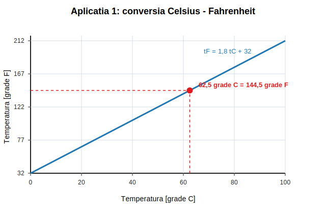
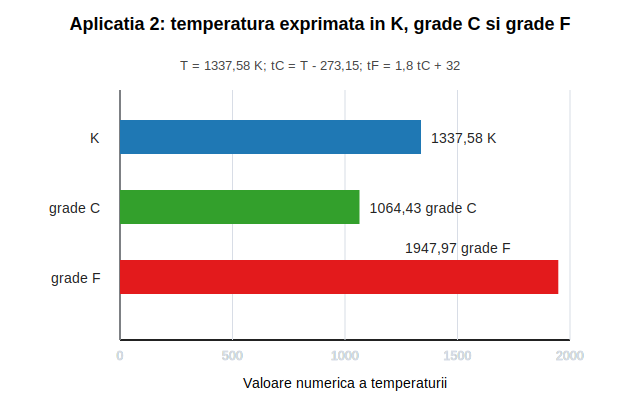

# Rezolvare - Lucrare de laborator nr. 1

## Masurarea temperaturii

### 1. Scopul lucrarii

Lucrarea are ca scop prezentarea principalelor metode si aparate folosite pentru masurarea temperaturii in practica industriala, precum si utilizarea scarilor de temperatura Celsius, Kelvin si Fahrenheit.

Temperatura este o marime de stare interna, intensiva, care caracterizeaza starea de agitatie termica a moleculelor unui corp.

### 2. Relatii folosite

Conversia dintre scara Celsius si Kelvin:

```text
T(K) = t(grade C) + 273,15
```

Conversia dintre scara Celsius si Fahrenheit:

```text
t(grade F) = 9/5 * t(grade C) + 32
```

Conversia din Kelvin in Celsius:

```text
t(grade C) = T(K) - 273,15
```

### 3. Mijloace de masurare a temperaturii

Termometrele de dilatare cu lichid functioneaza pe baza dilatarii unui lichid intr-un tub capilar sub actiunea caldurii. Lichidul poate fi mercur, alcool sau toluen.

Termometrele manometrice functioneaza pe baza modificarii presiunii unui fluid inchis intr-un sistem, atunci cand temperatura variaza.

Termometrele cu termocuplu functioneaza pe baza efectului Seebeck. Daca doua conductoare diferite formeaza un circuit, iar jonctiunile lor se afla la temperaturi diferite, apare o tensiune termoelectromotoare proportionala cu diferenta de temperatura.

Termometrele cu infrarosii masoara temperatura de suprafata a unui corp prin captarea energiei radiate sau reflectate de acesta.

Pirometrele de radiatie sunt folosite pentru masurarea temperaturilor inalte, prin determinarea radiatiei termice emise de corp.

### 4. Partea experimentala

Instalatia experimentala contine un traductor de temperatura cu termorezistenta introdus intr-un vas cu apa. Apa este incalzita cu o sursa de caldura, iar temperatura este indicata de aparatul electronic conectat la traductor.

In acelasi vas se monteaza si un termometru cu termocuplu, folosit ca etalon.

Pentru exemplificarea rezolvarii, se considera urmatoarele valori fictive, dar relevante pentru incalzirea treptata a apei:

| Masuratoare | t0 | t1 | t2 | t3 | t4 | t5 |
|---|---:|---:|---:|---:|---:|---:|
| t [grade C] | 22 | 31 | 42 | 54 | 67 | 78 |

Pe hartie milimetrica se reprezinta grafic:

```text
t[grade C] = f(tx)
```

Axa Ox reprezinta momentele masuratorilor `t0, t1, t2, t3, t4, t5`, iar axa Oy reprezinta temperatura masurata in grade Celsius.

Punctele care se reprezinta pe grafic sunt:

```text
(t0, 22), (t1, 31), (t2, 42), (t3, 54), (t4, 67), (t5, 78)
```

Graficul obtinut este crescator, deoarece apa primeste caldura de la sursa exterioara, iar temperatura ei creste in timp. Cresterea nu trebuie sa fie perfect liniara, deoarece schimbul de caldura depinde de puterea sursei, pierderile catre mediul exterior si modul de amestecare a apei.

### 5. Aplicatia 1

Doua termometre, unul gradat in Celsius si unul in Fahrenheit, sunt introduse in acelasi vas cu ulei. Termometrul Celsius indica:

```text
tC = 62,5 grade C
```

Se cere indicatia termometrului Fahrenheit.

Formula:

```text
tF = 9/5 * tC + 32
```

Inlocuire:

```text
tF = 9/5 * 62,5 + 32
tF = 1,8 * 62,5 + 32
tF = 112,5 + 32
tF = 144,5 grade F
```

Rezultat:

```text
tF = 144,5 grade F
```

Reprezentare grafica:



### 6. Aplicatia 2

Se da temperatura:

```text
T = 1337,58 K
```

Se cere exprimarea in scarile Celsius si Fahrenheit.

Conversia in Celsius:

```text
tC = T - 273,15
tC = 1337,58 - 273,15
tC = 1064,43 grade C
```

Conversia in Fahrenheit:

```text
tF = 9/5 * tC + 32
tF = 9/5 * 1064,43 + 32
tF = 1,8 * 1064,43 + 32
tF = 1915,974 + 32
tF = 1947,974 grade F
```

Rotunjit:

```text
tF = 1947,97 grade F
```

Rezultate:

```text
tC = 1064,43 grade C
tF = 1947,97 grade F
```

Reprezentare grafica:



### 7. Concluzii

Temperatura poate fi masurata prin metode bazate pe dilatare, variatie de presiune, efect termoelectric, radiatie infrarosie sau radiatie termica. Alegerea aparatului depinde de domeniul de temperatura, precizia necesara, mediul in care se face masurarea si posibilitatea contactului direct cu corpul masurat.

In aplicatiile numerice s-au folosit relatiile de conversie dintre scarile Celsius, Kelvin si Fahrenheit.
